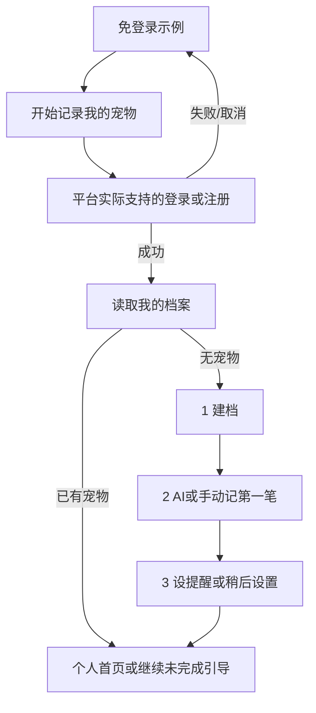
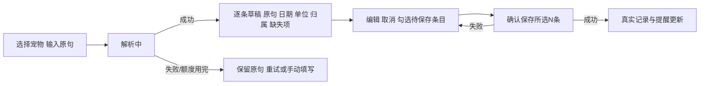

# 爪爪日记：四页层级与交互说明

状态：阶段0设计交付，供用户验收；本文的目标界面尚未实现。当前网页仍是v0.1.0本地体验版。

## 依据与边界

面向刚开始养猫狗的人，以“记录 → 提醒 → 成长回顾”为主线。访客和评审先体验明确标识的示例，创建自己的档案后才进入真实账户。界面模式为 **Operate**：让用户完成照顾和记录任务，继承奶油色、森林绿、宠物摄影、桌面侧栏与手机底栏。

来源：项目[产品方向](../../PRODUCT.md)、[完整需求](../../ROADMAP.md)、[总计划](../superpowers/plans/2026-10-06-paw-diary-master.md)与00–04阶段接口；本session用户确认逐阶段体验验收、免费优先/收费另行确认、默认AI无需用户自带Key、自带Key仅可选。前述决定不代表已开通云端、批准费用或选定模型。

本阶段产出布局、流程、状态和可检查标准。产品HTML/CSS/JS、原评审地址、四个hash入口及v0.1.0保持当前基线。阶段1实现本地闭环，阶段2实现真实身份与私有保存，阶段3实现AI和引导，阶段4实现共享社区与同城发现。未接通的入口不作为可点击的正式功能展示。

## 现状证据与设计处理

| 现状原文/截图 | 对用户的影响 | 目标处理与归属 |
| --- | --- | --- |
| `app.js:71`；阶段0的390px首页截图 | 手机先展示趋势及长时间线，再出现护理待办 | 手机待办提前；成长时间线首页最多3条，可进入健康页；阶段1实施 |
| `app.js:69,72` | 健康页和首页均只显示前4条待办 | 首页保留摘要，健康页提供完整待办和状态筛选；阶段1 |
| `app.js:72,95` | 记录无编辑入口，提醒缺改期/取消/完成回执 | 明确编辑和三态管理；完成与下一次安排分步保存；阶段1 |
| `app.js:48,51` | 写失败不更新state，有可继承基础；读失败却静默回示例 | 保留成功后才更新；读取故障单独显示恢复路径，保留原始数据；阶段1/2 |
| `index.html:12`、`app.js:87` | `#main`与业务hash路由冲突，浏览器等待hashchange后确认回首页 | 跳转内容只移动当前页焦点，不触发换页；阶段1 |
| `app.js:86,112` | 更新页面会替换控件DOM | 明确局部更新与焦点恢复，避免筛选/保存后丢位置；各阶段 |
| `style.css:1–9`、`index.html:30–31` | 已有token、原生dialog、focus-visible、polite提示和减少动画 | 继续复用，补可读字号、长内容、图片失败及异步状态 |

截图、浏览器取证JSON与检查脚本已归档到主工作区`test-results/stage0/`，不发布；现状测试结果和限制见[验收说明](ui-acceptance.md)。代码行号对应阶段0启动时未修改的产品源文件，不是未来实现行号。

## 模式、宠物与信息范围

全站顶栏持续显示当前模式和当前宠物。`mode='demo'`显示“示例体验 · 保存在此浏览器”，社区发布按钮明确“发布到本地示例”；`mode='account'`显示“我的档案”，只有服务确认成功后才提示云端保存。无法读取个人资料时显示加载/失败，不能拿示例宠物补位。账户无宠物时进入建档空状态；访客仍可回到示例。

切换宠物按`activePetId`，名字重复也不影响归属；草稿、提醒、趋势和回顾均显示宠物名。用户编辑中切换宠物/模式、换页或退出时，先允许继续编辑或确认放弃，不能把未保存内容悄悄写给另一只宠物。登录后不自动上传本地示例；本地自建资料导入须预览、逐项确认。

## 四页层级与低保真布局

### 成长首页：记一笔，看到接下来要做的事

唯一实心主按钮为“记一笔”。示例模式额外提供次级入口“开始记录我的宠物”；真实账户无记录时引导记第一笔。宠物卡展示身份、头像与必要资料，不占用手机大半屏。近期待办显示逾期/今天/近期的文字与日期，最多4项，附“查看全部N项”；数量来自当前宠物全部pending事项。

```text
桌面：顶栏[模式 / 当前宠物 / 城市]，标题[记一笔]
      左侧：宠物摘要 → 最新记录/体重 → 成长时间线(3条)
      右侧：近期护理(最多4项 / 查看全部) → 本周回顾
      底部：社区入口（次级）
手机：顶栏 → 标题/记一笔 → 紧凑宠物摘要 → 近期护理
      → 最新体重/记录 → 本周回顾 → 时间线(3条) → 社区入口
```

“记一笔”在阶段1为现有手动表单；阶段3接通后同一入口提供“一句话记录”和“手动填写”。保留新增记录反馈，不再另外堆一个同权重实心发布按钮。最新体重显示数值、kg和实际记录日期；只有一条记录显示单个点和文本，无记录显示“还没有体重记录 / 记一次体重”，不画虚构曲线。

待办为空显示“暂时没有待办 / 添加护理事项”，不暗示宠物无需护理。回顾未接通时不展示生成按钮；接通后记录少仍可查看真实摘要，无记录时引导记录，不能生成虚构故事。社区入口在主线之后，不插入护理信息之间。

### 健康档案：管理完整记录与护理事项

页首主按钮“添加记录”，当前宠物切换和档案编辑为次级；护理卡内提供“添加护理事项”。根据用户本地验收反馈，恢复原阅读顺序：宠物摘要/完整待办 → 体重趋势/成长足迹 → 完整记录。桌面三排布局同排等高，记录表跨两列；手机按同序自然单列，保留可编辑记录卡。视觉和DOM/键盘顺序一致，不仅用CSS把图表移到前面。待办完整列表可滚动查看，新增/筛选/导出留在列表外，不截掉项目。

记录列表支持类型、起止日期筛选，并显示筛选条数；清空筛选不改变记录。每条提供“查看/编辑”和“删除”，编辑保留id，保存成功后首页/趋势/时间线一致。手机采用记录卡，日期、类型、内容、备注与操作纵排；桌面保留语义表格，不能用截断隐藏唯一的编辑/删除入口。

待办以`pending|completed|cancelled`保存；“逾期/今天/近期”只是pending的日期分组，不新增业务状态。完整列表不限4项；完成/取消可查看状态历史。逾期事项显示准确日期，允许完成、修改日期和取消，不自动推演下次医疗周期。

“导出与恢复”是次级入口：JSON备份/恢复、当前筛选记录CSV、所选pending事项ICS。恢复先显示新增及冲突数量，再确认；默认不覆盖同id。导出ICS说明“导入系统日历后，由日历设置通知”，不声称网页已发送外部提醒。删除记录明确提示关联pending提醒会取消，已有完成记录不随意级联删除。

### 附近宠友：筛选伙伴，自愿公开有限资料

页首主操作“筛选伙伴”，展开城市、行政区、猫/狗、交流目的四项；当前筛选和“清空筛选”始终可见。保留六城范围，切换城市清除不合法行政区。未登录可读公开资料；只有主动加入发现的用户出现，初始不公开。

卡片显示公开昵称/头像、城市/行政区、宠物类型和目的，不公开健康史、登录邮箱、住址或虚构距离。示例与真实卡片分区并标明来源，不能混算人数。详情主操作“写一篇同城找搭子日常”，将所选城市/行政区/话题带入发布表单；不制作私信入口。

无匹配先提供“放宽行政区”和“清空条件”，再提供找搭子发布；未公开个人资料不阻断读帖或记录主线。“加入宠友发现”展示公开字段预览，再主动确认；退出后服务端查询排除该资料，界面提示“已退出发现”。身份或保存失败时保留设置，不误报已隐藏。

### 社区日常：发布真实日常，示例来源可辨

页首唯一主按钮“发布日常”；话题/同城筛选和搜索为次级。桌面两列feed加轻量话题栏，手机单列，来源标签和公开说明不能只放在手机会隐藏的侧栏。真实内容为空时显示“还没有真实日常 / 分享第一篇”，示例独立展示且数量单独计算。

公开帖子未登录可读，点赞/评论/发帖要求登录；触发后保留意图和已填文字，登录成功返回原位置。单图发布先有本地预览、移除/更换、上传中及重试，再发布正文。失败保留标题/正文和可重新选择图片的提示；服务返回发布成功才提示“已发布”。自己的帖子/评论提供编辑和删除；其他人的内容提供个人隐藏和举报回执，不伪装为全站删除。

## 主线流程与恢复

### 访客、登录和三步新手引导（阶段2/3）



只展示通过阶段2真实验证的认证方式；注册如需验证码，提供重发、返回和错误提示，不用按钮冒充登录完成。登录失败不清空输入；密码不存储为恢复草稿。退出立即清空当前账户的可见私有内容，并作废迟到请求；重新登录前原编辑内容不能显示给其他账户。

建档核心为名字、猫/狗、已知生日或估计年龄，两种年龄互斥；品种、性别、到家日期、头像可后补，不默填一个“真实生日”。保存后才进第二步。第一条记录支持AI/手动，完成记录后才进提醒，提醒可跳过。步骤由已有实体和`PET_SAVED|RECORDS_SAVED|REMINDER_SAVED|REMINDER_SKIPPED`推进，不重复创建实体。

中断后显示“继续上次建档”，进度与账户隔离；已保存记录保留，未提交草稿只在当前用户范围恢复。刷新/退出/登录过期分别验收；退出后的新账户不能读到旧草稿。没有AI服务时手动记录仍完整可用。

### 一句话 → 多条草稿 → 确认保存（阶段3）



草稿还不是记录，解析/取消/关闭不改变健康记录数。每条显示宠物归属、绝对日期、类型、数值/单位、名称、备注、可选下次日期、原句引用；原句与结果并列可核对。缺失必填信息定位到具体字段，多宠物/同名不得猜id。“下个月”等不明确提醒日期，让用户补充准确日期或明确选择“不设置提醒”，不能静默忽略原句要求。

只确认选中的有效草稿，按钮显示数量；未选或被取消的条目不保存。提交期间禁重复点击，失败保留草稿；超时/结果不明时以同一幂等键查询或重试，不制造重复记录。单位转换同时显示原值与kg；日期按服务端时钟和Asia/Shanghai解析。药物、剂量、医院和诊断等原句未给信息不补造。

默认AI体验无需用户自带Key，但真实私有AI解析/写入仍需登录。访客可免登录体验明确标识的示例或手动记录，不能暗示已开放匿名模型接口。服务可用性、限额/等待提示必须与后台实际配置一致；不能展示未经核算的“永久免费”。默认额度用完提供手动分支。供应商替换保持相同草稿协议；自带Key作为可选后续能力，尚无供应商/密钥存储/端点策略，阶段0不扩大为必做设置页。

### 完成护理 → 可选下一次（阶段1）

选择pending事项 → 显示事项、宠物、原到期日 → 用户填写实际完成日期/可选备注 → 确认完成。取消/关闭不改变状态。成功后同一事项变为completed且关联唯一完成记录；重复请求返回已有回执。源记录存在则沿用护理类型，独立事项记通用日常事实，不猜疫苗或药物名称。

完成成功后才显示“安排下一次 / 暂不安排”。下一次日期由用户填写，通过`saveReminder`另行保存；若新提醒失败，保留已完成回执、日期输入和“重试安排”，不让用户再次完成原事项。取消提醒经确认变为cancelled，不等于删除原健康记录。

### 有依据回顾 → 公开分享（阶段3/4）

选择当前宠物和日期范围 → 代码计算次数/体重差/待办 → AI组织文案 → 私有回顾详情。详情显示范围、生成时间、实际数值、可展开的原记录依据及“重新生成”。零记录只显示空状态，不调用模型编故事；资料不足如实提示。引用记录修改后显示“记录已更新，这份回顾可能过时”，重新生成前不伪装为最新。

分享先调用`prepareRecapShare`展示可编辑的公开预览，默认不含体重和健康数值，预览显示最终公开内容而非整份私有回顾。阶段3只提供预览，阶段4接通后才提供真实发布；取消不生成帖子，发布成功有链接/返回社区。生成、保存私有回顾、预览、公开发布的反馈文案分别清楚。

## 事件与既有接口对应

| 用户操作 | 既定接口/事件 | 成功与失败规则 |
| --- | --- | --- |
| 进入当前模式/账户 | `Repository.snapshot()` / `health.snapshot` | 有数据才展示；失败可重试，不替换为示例 |
| 保存/编辑档案或记录 | `savePet` / `saveRecord`，云端`pets.save` / `records.save` | 保存成功后提交snapshot；失败保留输入 |
| 删除记录 | `deleteRecord` / `records.delete` | 先确认，关联pending提醒取消 |
| 添加/改期/取消提醒 | `saveReminder` / `reminders.save` | 复用三态；取消不删历史 |
| 完成提醒 | `completeReminder` / `reminders.complete` | 完成记录和回执一起成功；安排下一次独立保存 |
| 备份预览/确认 | `previewImport` / `mergeBackup` | 预览不写入；冲突默认不覆盖 |
| 导出记录/事项 | `exportRecordsCsv` / `exportRemindersIcs` | 不改记录状态；ICS只选pending |
| 登录/退出 | `AuthAdapter.signIn` / `signOut` / `subscribe` | 可信平台身份；注销迟到响应 |
| AI解析/确认 | `ai.records.parse` / `ai.records.confirm` | 原句→草稿→明确确认；只确认有效选中条目 |
| 回顾生成/读取 | `ai.recaps.generate` / `ai.recaps.list` | 私有存储、范围和引用可核对 |
| 发布/点赞/评论 | `community.save` / `likes.set` / `comments.save` | 身份与作者权检查；点赞set目标状态 |
| 找伙伴/公开或退出 | `profiles.discover` / `profiles.saveOwn` | 仅主动公开字段；城市变化清无效区 |

所有新数据操作使用既定Promise接口；UI操作状态统一为`idle|loading|success|error`，不再另造“解析中”等业务枚举。加载文案可以不同，但状态名不变。权限错误`UNAUTHENTICATED|FORBIDDEN|INVALID_INPUT|CONFLICT|UNAVAILABLE`对应恢复说明；本地异常以相同用户可理解路径显示，不冒充网络成功。

## 用户阶段验收路线

先核对手机首页的“记一笔 → 近期护理 → 最新记录 → 回顾/时间线”顺序，再核对健康页“完整待办 + 可编辑记录 + 导出恢复”。随后顺着登录/三步引导、AI多条确认、护理完成/下一次、回顾分享流程，检查自己是否能理解每一步保存了什么、取消会发生什么、失败后去哪里。

阶段0审查的是可实施设计与验收表，不是未来按钮已可操作。用户确认这些层级和流程后，才进入阶段1；真实云端、AI及社区逐阶段单独验收。[组件与响应式验收](ui-acceptance.md)列出执行用例和证据要求。
